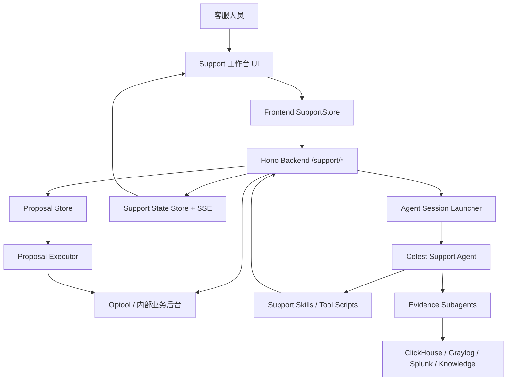
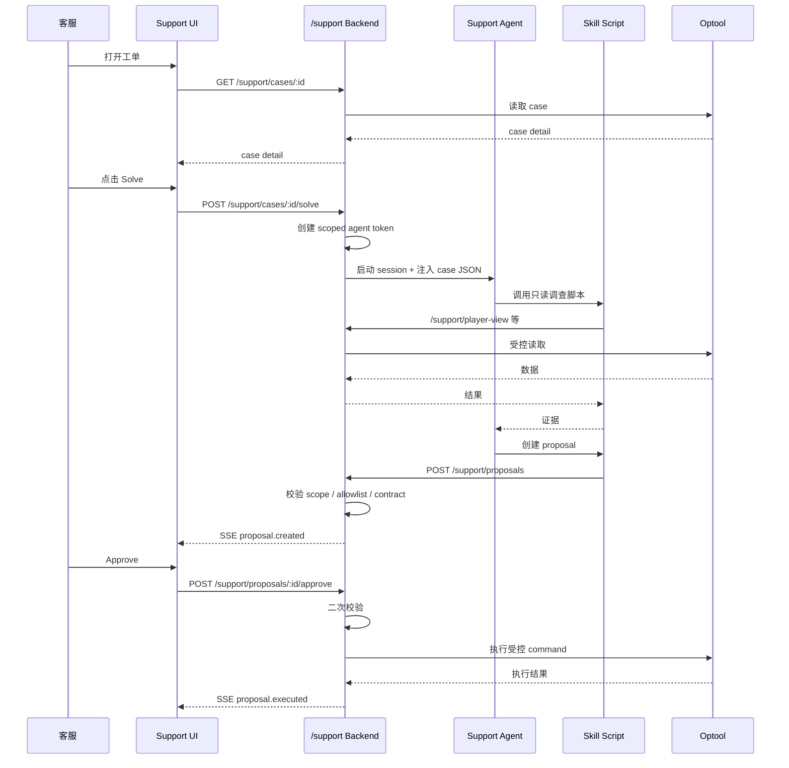
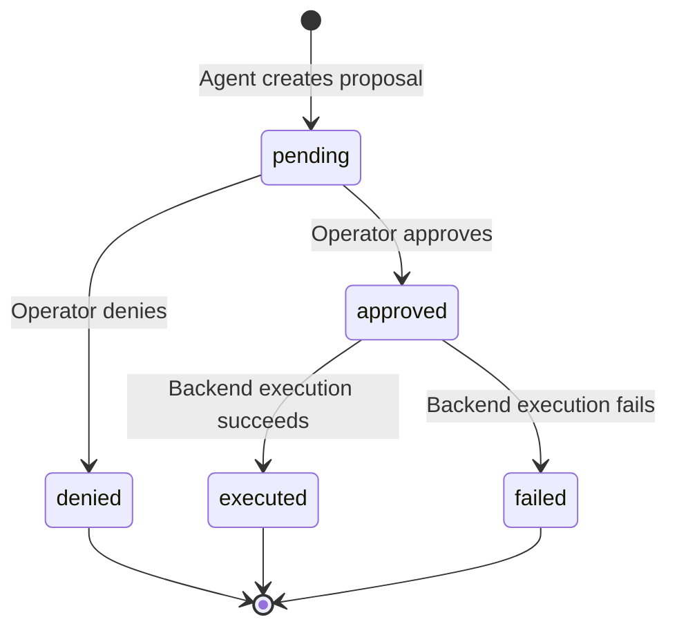

# Celest Support 垂直领域 Agent 系统完整搭建与迁移指南

版本：2026-05-12  
目标读者：完全不懂 Agent 系统搭建，但希望从零复刻 Celest Support 架构，并迁移到其他垂直领域的工程师 / 产品技术负责人 / AI 应用架构师  
核心目标：不仅知道“怎么接大模型”，更知道**如何把大模型安全、可控、可审计地嵌入真实业务流程**

---

## 目录

1. [一句话理解这个系统](#1-一句话理解这个系统)
2. [Celest Support 的本质](#2-celest-support-的本质)
3. [它使用了什么框架和技术](#3-它使用了什么框架和技术)
4. [完整系统架构](#4-完整系统架构)
5. [从零开始搭建前必须先做的业务建模](#5-从零开始搭建前必须先做的业务建模)
6. [目录结构如何设计](#6-目录结构如何设计)
7. [Agent 本体如何搭建](#7-agent-本体如何搭建)
8. [Policy / Playbook / Knowledge 如何搭建](#8-policy--playbook--knowledge-如何搭建)
9. [Skill / Tool 系统如何搭建](#9-skill--tool-系统如何搭建)
10. [后端 API Gateway 如何搭建](#10-后端-api-gateway-如何搭建)
11. [Proposal 人审系统如何搭建](#11-proposal-人审系统如何搭建)
12. [前端工作台如何搭建](#12-前端工作台如何搭建)
13. [Agent Session 启动器如何搭建](#13-agent-session-启动器如何搭建)
14. [权限、安全与审计如何设计](#14-权限安全与审计如何设计)
15. [子 Agent / Evidence 系统如何搭建](#15-子-agent--evidence-系统如何搭建)
16. [本地开发、Docker 与部署架构](#16-本地开发docker-与部署架构)
17. [测试、验收与评估体系](#17-测试验收与评估体系)
18. [与业务强相关的部分](#18-与业务强相关的部分)
19. [迁移到其他垂直领域的方法](#19-迁移到其他垂直领域的方法)
20. [一步一步复刻实施路线图](#20-一步一步复刻实施路线图)
21. [最容易踩的坑](#21-最容易踩的坑)
22. [面试 / 简历中如何体现深刻理解](#22-面试--简历中如何体现深刻理解)
23. [最终检查清单](#23-最终检查清单)

---

# 1. 一句话理解这个系统

Celest Support 不是一个“客服聊天机器人”。

它是一个：

```text
面向内部客服场景的垂直领域 Agent 工作流系统。
```

更准确地说，它是：

```text
AI 调查员 + 领域知识库 + 工具调用系统 + 人工审批流 + 后端安全执行器 + 客服工作台 + 审计系统
```

它的核心闭环是：

```text
客服打开工单
  -> Agent 读取工单
  -> Agent 拆解玩家诉求
  -> Agent 调用受控工具查证据
  -> Agent 根据政策和 playbook 形成处理建议
  -> Agent 创建 proposal
  -> 人类客服审批
  -> 后端安全执行
  -> 系统记录审计
  -> 玩家收到回复
```

一句话总结：

```text
它不是让大模型直接做客服，而是把大模型放进一个受控、可审计、有人类审批的业务执行框架里。
```

---

# 2. Celest Support 的本质

## 2.1 它解决什么问题

传统客服处理复杂工单时，需要在多个系统之间切换：

```text
1. 查看 support case。
2. 读取玩家描述。
3. 查看附件。
4. 查询玩家账号。
5. 查询玩家当前位置。
6. 查询库存、物品、交易、经济历史。
7. 查询支付、账号安全、登录设备。
8. 查询历史工单。
9. 查询日志、崩溃、后台事件。
10. 根据内部政策判断是否处理。
11. 编写玩家回复。
12. 执行后台操作。
13. 添加内部备注。
14. 关闭或升级工单。
```

这些工作高度依赖经验，而且容易出错。

Celest Support 的设计目标是：

```text
让 Agent 自动完成调查、证据收集、政策匹配和方案生成；
但不让 Agent 直接执行高风险操作；
最终执行权仍由人工客服掌握。
```

## 2.2 它的系统角色

Celest Support 中有几个角色：

| 角色 | 作用 |
|---|---|
| 玩家 / 用户 | 提交 support case |
| 客服人员 | 打开工单、查看 AI 调查、审批 proposal |
| Agent | 读取工单、查证据、生成建议、创建 proposal |
| 后端 Gateway | 控制权限、代理内部系统、校验 proposal、执行审批后的动作 |
| Optool / 内部后台 | 真正承载账号、玩家、工单、物品、经济等业务操作 |
| Evidence Subagents | 负责日志、经济历史、崩溃、知识库等专项调查 |

## 2.3 它不是哪些东西

它不是：

```text
普通 Chatbot
FAQ 问答机器人
单 Prompt Demo
直接执行后台操作的 AI
任意 SQL 查询器
无权限边界的自动化工具
```

它是：

```text
业务流程型 Agent
高风险操作受控执行系统
垂直领域专家工作台
人机协作客服平台
```

---

# 3. 它使用了什么框架和技术

下面是当前 Celest Support 系统使用的主要技术。

## 3.1 语言与运行时

| 层 | 技术 |
|---|---|
| 主要语言 | TypeScript |
| 运行时 | Bun |
| Bun 版本要求 | 1.3.10+ |
| 脚本执行 | Bun / PowerShell / batch scripts |
| 包管理 | Bun workspaces |

当前 `justfile` 中有版本检查：

```text
bun_min_version := "1.3.10"
```

安装依赖：

```powershell
just install
```

构建检查：

```powershell
just build
```

## 3.2 后端框架

当前 support backend 主要在：

```text
apps/terminal-webui/src/server/support-routes.ts
```

使用：

| 能力 | 技术 |
|---|---|
| HTTP Server / Routing | Hono |
| Cookie | hono/cookie |
| SSE | hono/streaming 的 `streamSSE` |
| 加密/随机 ID | Node crypto `randomUUID` |
| 文件路径 | Node path |
| 运行时 | Bun |

典型导入：

```ts
import { Hono } from "hono"
import { deleteCookie, getCookie, setCookie } from "hono/cookie"
import { streamSSE } from "hono/streaming"
```

## 3.3 前端框架

当前有两类前端相关包：

### 3.3.1 Support 工作台所在 UI

主要路径：

```text
opencode/packages/app/src/pages/support-cases.tsx
opencode/packages/app/src/pages/support-case-detail.tsx
opencode/packages/app/src/context/support-store.tsx
```

使用：

| 能力 | 技术 |
|---|---|
| UI 框架 | SolidJS |
| 路由 | @solidjs/router |
| 状态 | Solid signal / store |
| 样式 | Tailwind / 项目内 UI token |
| 构建 | Vite |

典型导入：

```ts
import { For, Show, createMemo, createSignal } from "solid-js"
import { useNavigate } from "@solidjs/router"
```

### 3.3.2 terminal-webui 包

路径：

```text
apps/terminal-webui/
```

其 package 中包含：

| 能力 | 技术 |
|---|---|
| 客户端构建 | Vite |
| React 依赖 | React 18 / React DOM |
| 查询库 | TanStack React Query |
| 终端 UI | xterm |
| PTY | bun-pty |
| 后端 | Hono |

这意味着当前系统中既有 OpenCode/SolidJS UI，也有 terminal-webui 相关的 React/xterm 能力。

如果你从零复刻，可以选择 React 或 SolidJS。  
如果要尽量贴近当前实现，support case 工作台使用 SolidJS + Vite。

## 3.4 Agent Runtime

当前系统通过 OpenCode / Codex / Claude 类 agent runtime 启动会话。

关键配置：

```text
opencode.json
```

当前内容：

```json
{
  "$schema": "https://opencode.ai/config.json",
  "default_agent": "celest",
  "model": "anthropic/claude-sonnet-4-6",
  "skills": {
    "paths": [
      "agents/celest-support/skills"
    ]
  }
}
```

也就是说：

```text
1. 默认 agent 是 celest。
2. 默认模型配置在 opencode.json。
3. support skills 通过 agents/celest-support/skills 暴露。
```

Support agent 会话由后端启动，并注入：

```text
case JSON
agent token
support mode
optool context
环境变量
必须阅读的 agent.md / policy / framework
```

## 3.5 Plugin / Skill 体系

插件配置：

```text
agents/celest-support/.codex-plugin/plugin.json
```

其中声明：

```json
{
  "name": "celest-support",
  "version": "0.1.0",
  "description": "Celest Support skills for Codex support-case sessions...",
  "skills": "./skills/"
}
```

当前 skill 目录：

```text
agents/celest-support/skills/
```

包含：

```text
jira-bug-report
player-account
player-actions
player-information
self-improvement
support-cases
```

当前脚本数量：

| Skill | TypeScript 脚本数 |
|---|---:|
| jira-bug-report | 1 |
| player-account | 48 |
| player-actions | 15 |
| player-information | 22 |
| self-improvement | 1 |
| support-cases | 15 |

## 3.6 数据与存储

| 数据 | 当前方式 |
|---|---|
| live proposal | 内存 Map |
| proposal 历史 / timeline | SQLite side-channel |
| support state | 内存状态 + SSE 推送 |
| Optool 登录态 | 后端内存 Map + cookie/session |
| case / player / account 数据 | Optool / 内部后台代理读取 |
| 历史经济 / 日志 / 崩溃证据 | ClickHouse / Graylog / Splunk 等外部 evidence 系统 |

关键点：

```text
live approval flow 主要依赖后端进程内存；
SQLite 用于历史镜像和 timeline，不应误认为所有 live state 都永久可靠。
```

## 3.7 部署技术

| 层 | 技术 |
|---|---|
| 容器 | Docker |
| 编排 | Docker Compose |
| 前端服务 | Nginx / frontend container |
| 后端服务 | celest-core / terminal-pty |
| workspace | celest-workspace image |
| 动态 agent workspace | Docker socket + workspace containers |

当前 compose 包含服务：

```text
frontend
celest-core
celest-workspace
terminal-pty
opencode
slack-bot-router
scheduler
agent-orchestrator
dashboard-api
artifacts
admin
```

---

# 4. 完整系统架构

## 4.1 高层架构图



## 4.2 分层解释

| 层 | 作用 | 当前实现 |
|---|---|---|
| 前端工作台 | 给客服看工单、AI 会话、proposal | SolidJS pages + SupportStore |
| Backend Gateway | 提供 `/support/*` API、权限、代理、SSE | Hono + TypeScript |
| Agent Runtime | 启动 LLM agent 会话 | OpenCode / Codex / Claude runtime |
| Agent Instructions | 定义 agent 角色和规则 | `agents/celest-support/agent.md` |
| Domain Knowledge | 政策、决策框架、playbook | `resources/*.md` |
| Skills / Tools | 受控工具脚本 | `skills/*/scripts/*.ts` |
| Proposal System | 人审提案流 | ProposalStore + Executor + Allowlist |
| Business Backend | 真实业务系统 | Optool / 内部服务 |
| Evidence Systems | 历史证据与日志 | ClickHouse / Graylog / Splunk |

## 4.3 一次完整处理链路



---

# 5. 从零开始搭建前必须先做的业务建模

很多人搭 Agent 的第一步就是写 prompt，这是错误的。

垂直领域 Agent 的第一步应该是业务建模。

## 5.1 先回答 10 个业务问题

在写任何代码前，先回答：

```text
1. 谁使用这个 Agent？
2. Agent 服务什么业务流程？
3. 业务输入是什么？
4. 业务输出是什么？
5. 哪些动作是只读？
6. 哪些动作会改变业务状态？
7. 哪些动作是高风险？
8. 哪些动作必须人工审批？
9. Agent 需要哪些内部系统的数据？
10. 出错后如何追责和回滚？
```

Celest Support 的答案类似：

| 问题 | Celest Support 答案 |
|---|---|
| 谁使用 | 内部客服 |
| 输入 | support case、玩家描述、附件 |
| 输出 | 调查结论、proposal、玩家回复 |
| 只读动作 | 查 case、查账号、查库存、查历史 |
| 写动作 | 回复、关闭工单、补偿、改账号、传送玩家 |
| 高风险 | 涉及账号、安全、资产、经济、玩家状态 |
| 审批 | 所有 mutation 都需要 |
| 内部系统 | Optool、ClickHouse、Graylog、Splunk、Jira |
| 追责 | proposal audit + 审批人 + 执行结果 |

## 5.2 把业务对象建模出来

Celest Support 的核心业务对象：

```text
SupportCase
CasePost
Attachment
Player
Account
Item
Transaction
Proposal
Operator
AuditRecord
```

如果迁移到其他领域，比如金融风控，业务对象可能是：

```text
RiskCase
Customer
Account
Transaction
KYCRecord
Alert
ActionProposal
Reviewer
AuditRecord
```

如果迁移到医疗保险审核，业务对象可能是：

```text
Claim
Patient
Provider
Policy
MedicalRecord
BillingItem
ApprovalProposal
Reviewer
AuditRecord
```

## 5.3 把动作分级

这是非常重要的一步。

建议把所有动作分成四类：

| 等级 | 类型 | 示例 | 是否允许 Agent 自动执行 |
|---|---|---|---|
| L0 | 纯文本分析 | 总结、分类、提取字段 | 可以 |
| L1 | 只读查询 | 查工单、查账号、查历史 | 可以，但要白名单 |
| L2 | 低风险写入 | 添加内部备注、草稿回复 | 建议 proposal |
| L3 | 高风险变更 | 改账号、发钱、补偿、关闭 case | 必须人工审批 |

Celest Support 的设计是：

```text
所有 support/player/account/economy/item/security mutation 都走 proposal。
```

## 5.4 设计业务 SOP / Playbook

不要让 Agent 自己猜处理流程。

应该把专家经验写成 playbook：

```text
如果是物品丢失：
  1. 读取 case。
  2. 检查附件。
  3. 查询库存。
  4. 查询 item history。
  5. 查询交易/拍卖/经济历史。
  6. 判断是否有系统错误或玩家操作。
  7. 根据政策决定回复、补偿或升级。

如果是玩家卡住：
  1. 查询当前位置。
  2. 查询最近位置。
  3. 判断是否安全区。
  4. 创建 teleport proposal。
  5. 创建回复 proposal。
```

这一步决定 Agent 是否“懂业务”。

---

# 6. 目录结构如何设计

## 6.1 当前 Celest Support 目录

核心目录：

```text
agents/celest-support/
  agent.md
  resources/
  skills/
  subagents/
  lib/
  tests/
  .codex-plugin/

apps/terminal-webui/src/server/
  support-routes.ts
  support/
    proposal-store.ts
    proposal-executor.ts
    proposal-allowlist.ts
    support-db.ts
    support-state-store.ts
    support-workspace.ts

opencode/packages/app/src/
  context/support-store.tsx
  pages/support-cases.tsx
  pages/support-case-detail.tsx
```

## 6.2 推荐通用目录模板

如果你要迁移到其他垂直领域，可以使用这个结构：

```text
agents/<domain-agent>/
  agent.md
  resources/
    POLICIES.md
    DECISION_FRAMEWORK.md
    CASE_PLAYBOOK.md
    playbooks/
      <case-type-1>.md
      <case-type-2>.md
  skills/
    cases/
      SKILL.md
      scripts/
    entity-information/
      SKILL.md
      scripts/
    entity-actions/
      SKILL.md
      scripts/
    account-operations/
      SKILL.md
      scripts/
  subagents/
    data-investigator.md
    log-investigator.md
    knowledge-retriever.md
  lib/
    proposal.ts
    read-client.ts
    auth.ts
  tests/
    scenarios/
    skill-tests/
  .codex-plugin/
    plugin.json

apps/<domain-workbench>/src/server/
  routes.ts
  proposal-store.ts
  proposal-executor.ts
  proposal-allowlist.ts
  state-store.ts
  auth.ts
  workspace.ts

apps/<domain-workbench>/src/frontend/
  store.ts
  list-page.tsx
  detail-page.tsx
  proposal-card.tsx
```

## 6.3 设计原则

目录分层要体现：

```text
Agent 指令
业务知识
工具能力
后端安全边界
前端人审界面
测试体系
```

不要把所有东西都堆在一个 prompt 或一个 tools.ts 文件里。

---

# 7. Agent 本体如何搭建

## 7.1 Agent 本体文件

当前文件：

```text
agents/celest-support/agent.md
```

这个文件定义：

```text
1. Agent 是谁。
2. Agent 服务谁。
3. Agent 的职责。
4. Agent 的禁止行为。
5. Agent 每次 case 必须执行的流程。
6. Agent 可以使用哪些知识来源。
7. Agent 什么时候必须创建 proposal。
8. Agent 如何写玩家回复。
9. Agent 如何处理证据不足。
10. Agent 如何使用 subagents。
```

## 7.2 当前 Agent 的定位

当前 agent.md 的核心身份是：

```text
Celest Support - Internal Investigator
```

它不是“客服聊天员”，而是：

```text
内部调查员
证据收集者
政策执行辅助者
proposal 创建者
客服审查者的助手
```

## 7.3 Agent Operating Contract

Agent 每次处理 case 必须：

```text
1. 读取 RULES-POLICIES.md。
2. 读取 DECISION_FRAMEWORK.md。
3. 读取 support case thread。
4. 下载并检查附件。
5. 把玩家陈述拆成 claims。
6. 不把玩家说法当成事实。
7. 拉取正常 support/player context。
8. 根据 CASE_PLAYBOOK.md 找对应 playbook。
9. 用证据和政策判断。
10. 老 case / 历史问题要查历史数据源。
11. 日志问题用 log-investigator。
12. 崩溃问题用 crash-investigator。
13. 稀有机制问题用 knowledge-retriever。
14. 合理动作通过 approved proposal scripts 创建。
15. 玩家回复必须温和、具体、符合政策、基于事实。
```

## 7.4 为什么 agent.md 不能只写“你是客服”

普通写法：

```text
你是一个客服助手，请帮助用户解决问题。
```

这是不够的。

生产级垂类 Agent 的指令必须明确：

```text
身份
业务边界
工具边界
证据规则
流程顺序
输出格式
禁止事项
人审机制
升级路径
安全策略
```

否则模型会：

```text
跳过证据
直接相信用户
编造解释
越权调用工具
泄露内部信息
直接给出高风险建议
```

## 7.5 通用 agent.md 模板

迁移到其他领域时，可以用这个结构：

```md
# <Domain> Agent - Internal Investigator

You are an internal <domain> investigation agent.
Your job is to understand the case, gather evidence, apply policy, and create proposal cards for human review.

## Operating Contract

1. Read POLICIES.md at the start of every case.
2. Read DECISION_FRAMEWORK.md before deciding.
3. Read the full case thread and identify the user's ask, timeline, evidence, and risk.
4. Convert user statements into claims to verify.
5. Use approved read tools to gather evidence.
6. Use CASE_PLAYBOOK.md to choose the correct investigation path.
7. Never treat user claims as facts until verified.
8. Never execute mutations directly.
9. Create proposal cards for every state-changing action.
10. Write user-visible messages that are policy-safe and do not expose internal evidence.

## Canonical Sources

- POLICIES.md
- DECISION_FRAMEWORK.md
- CASE_PLAYBOOK.md
- skills/*/SKILL.md
- subagents/*.md

## Safety Rules

- No direct mutations.
- No raw credentials.
- No unapproved tools.
- No unsupported facts.
- No secret leakage.
- No bypassing proposal approval.
```

---

# 8. Policy / Playbook / Knowledge 如何搭建

## 8.1 当前资源目录

```text
agents/celest-support/resources/
```

核心文件：

```text
RULES-POLICIES.md
DECISION_FRAMEWORK.md
CASE_PLAYBOOK.md
case_playbook_library/
```

## 8.2 POLICIES 是什么

Policy 回答：

```text
什么能做？
什么不能做？
什么必须升级？
什么必须拒绝？
什么可以补偿？
什么不能告诉用户？
```

例如客服领域：

```text
玩家自己交易失误是否补偿？
系统错误导致损失是否补偿？
账号安全问题如何回复？
支付问题如何处理？
物品丢失要查哪些证据？
哪些情况不能透露内部检测细节？
```

## 8.3 DECISION_FRAMEWORK 是什么

Decision Framework 回答：

```text
Agent 应该如何判断证据是否足够？
如何处理证据矛盾？
如何判断是否 action-worthy？
如何决定回复、关闭、升级或创建 proposal？
```

推荐结构：

```text
1. Identify the claim
2. Identify required evidence
3. Gather evidence
4. Evaluate sufficiency
5. Check policy
6. Choose outcome
7. Explain reasoning
8. Create proposal if action is justified
```

## 8.4 CASE_PLAYBOOK 是什么

Case Playbook 是 case 类型到调查路径的路由表。

例如：

```text
卡住 -> location playbook
物品丢失 -> item history playbook
支付失败 -> payment playbook
崩溃 -> crash playbook
账号安全 -> account security playbook
行为举报 -> misconduct playbook
```

## 8.5 为什么这层很重要

如果没有 policy/playbook，Agent 会像通用聊天模型一样自由发挥。

有了 policy/playbook 后，Agent 的行为变成：

```text
按业务流程调查
按业务规则判断
按标准口径回复
按风险等级提案
```

这就是“垂类 Agent”的核心。

---

# 9. Skill / Tool 系统如何搭建

## 9.1 当前 Skill 分类

Celest Support 当前 skill：

```text
support-cases
player-information
player-actions
player-account
jira-bug-report
self-improvement
```

## 9.2 Skill 分层原则

不要把工具按技术接口拆。

应该按业务能力拆：

| Skill | 业务含义 |
|---|---|
| support-cases | 工单读取、回复、关闭、升级 |
| player-information | 玩家只读调查 |
| player-actions | 玩家世界状态操作 proposal |
| player-account | 账号只读与账号操作 proposal |
| jira-bug-report | 明确要求时创建 bug |
| self-improvement | 支持流程改进 proposal |

迁移到其他领域，也应按业务能力拆。

例如保险领域：

```text
claims
policy-information
customer-information
provider-information
claim-actions
fraud-investigation
appeals
```

## 9.3 Read Tool 与 Write Tool 必须分开

这是最重要的工程原则之一。

工具分两类：

```text
只读工具：查询信息，不改变系统状态。
写工具：会改变系统状态，不能直接执行，只能创建 proposal。
```

Celest Support 中：

```text
player-information 基本是只读。
player-actions 基本是 proposal 创建。
player-account 同时有只读脚本和 proposal 脚本。
support-cases 有只读脚本和 proposal 脚本。
```

## 9.4 一个 Skill 的标准结构

```text
skills/<skill-name>/
  SKILL.md
  scripts/
    read-something.ts
    create-something-proposal.ts
```

`SKILL.md` 应该说明：

```text
这个 skill 什么时候使用
有哪些脚本
每个脚本的参数
每个脚本的输出
注意事项
是否只读
是否创建 proposal
```

## 9.5 Skill Script 应该做什么

一个 read script 应该：

```text
1. 解析命令行参数。
2. 读取 agent token / backend URL。
3. 调用 backend 的受控 read endpoint。
4. 输出结构化 JSON 或清晰文本。
5. 不做权限绕过。
```

一个 proposal script 应该：

```text
1. 解析 case_id/account_id/planet_id/reason 等参数。
2. 构造 proposal。
3. 构造 presentation。
4. 构造 execution.steps。
5. 调用 POST /support/proposals。
6. 输出 proposal id 和摘要。
```

## 9.6 Skill Script 不应该做什么

不要：

```text
直接调用生产写接口
直接持有后台账号密码
绕过 backend gateway
在脚本里做不可审计 mutation
把所有系统 API 原样暴露给 Agent
返回未过滤的敏感数据给玩家回复
```

## 9.7 通用 Skill 设计模板

```md
# Skill: <domain-capability>

Use this skill when the agent needs to <business purpose>.

## Read Scripts

- `get-case-details.ts`
  - Purpose: read current case.
  - Inputs: case_id.
  - Output: case JSON.
  - Safety: read-only.

## Proposal Scripts

- `create-close-case-proposal.ts`
  - Purpose: create a human-reviewable proposal to close a case.
  - Inputs: case_id, account_id, reason, player_message.
  - Output: proposal id.
  - Safety: does not close case directly.

## Rules

- Never call write APIs directly.
- Always include reason.
- User-visible messages must follow policy.
```

---

# 10. 后端 API Gateway 如何搭建

## 10.1 当前后端入口

```text
apps/terminal-webui/src/server/support-routes.ts
```

使用 Hono 构建。

主要职责：

```text
Optool 登录状态
工单读取
附件下载
只读工具代理
player/account 查询
proposal 创建
proposal 审批
proposal 拒绝
agent token
agent session 启动
state snapshot
SSE stream
Jira bug report
```

## 10.2 当前主要路由

### 状态与登录

```text
GET  /support/status
GET  /support/optool-status
POST /support/optool-target
POST /support/optool-login
POST /support/optool-logout
GET  /support/optool-credentials   # tombstone, 410
```

### Agent token 与 related account

```text
POST /support/agent-token
GET  /support/agent-related-accounts
POST /support/agent-related-accounts
```

### 只读代理

```text
POST /support/optool-read
POST /support/optool-search-view
POST /support/player-view
GET  /support/player-view/:view
GET  /support/account-report/:account_id
GET  /support/account-report/:account_id/view/:view_key
GET  /support/account-report/:account_id/related/:view_key/:related_id
GET  /support/player-report/:account_id
GET  /support/item-history/:item_id
```

### 工单

```text
GET  /support/cases
GET  /support/cases/:id
GET  /support/cases/:id/attachments
GET  /support/cases/:id/attachments/download
GET  /support/queue
GET  /support/account/:id/cases
GET  /support/players/:id/support-cases
```

### 工单动作

```text
POST /support/cases/:id/checkout
POST /support/cases/:id/reply
POST /support/cases/:id/comment
POST /support/cases/:id/state
POST /support/cases/:id/release
POST /support/cases/:id/close
POST /support/cases/:id/reopen
```

这些动作虽然存在后端路由，但 Agent 正常不应该直接绕过 proposal 调它们。

### Agent session

```text
POST /support/cases/:id/analyze
POST /support/cases/:id/solve
```

### Proposal

```text
POST /support/proposals
POST /support/proposals/:id/approve
POST /support/proposals/:id/deny
```

### State

```text
GET /support/state
GET /support/stream
```

## 10.3 Gateway 为什么必要

不要让 Agent 直接访问内部系统。

必须有后端 Gateway，因为它负责：

```text
认证
授权
参数校验
白名单
脱敏
scope 限制
审计
错误处理
状态同步
```

如果没有 Gateway，Agent 工具调用就会变成：

```text
LLM -> 内部生产系统
```

这在高风险业务里不可接受。

## 10.4 只读白名单

Celest Support 不允许任意 Optool command。

它只允许特定只读命令，例如：

```text
Account.Find
Account.Find.JSON
Player.Stats
Player.ViewProfessions
Player.ViewPreviousPositions
Player.ViewPersistent
Player.ViewCharDef
Player.LocateAvatar
Skills.ShowProfessions
Invites.GetInfo
Invites.GetInvitedFriends
EffectOverTime.ListActive
EntityModifiers.ListActive
ClientCrashes.URL
ClientCrashes.eupdkURL
StandardReply.List
StandardReply.Get
Quest.ShowPlayerData
Item.Find
Item.Data
```

迁移到其他领域时，也要建立类似：

```text
READ_COMMAND_ALLOWLIST
READ_VIEW_ALLOWLIST
READ_FIELD_ALLOWLIST
```

## 10.5 Gateway 通用伪代码

```ts
const app = new Hono()

app.get("/status", statusHandler)
app.post("/login", loginHandler)

app.post("/read", async (c) => {
  const token = requireAgentToken(c)
  const body = await c.req.json()
  assertCommandAllowed(body.command)
  assertScope(token, body)
  const result = await internalBackend.read(body.command, body.params)
  return c.json(sanitize(result))
})

app.post("/proposals", async (c) => {
  const token = requireAgentToken(c)
  const proposal = await c.req.json()
  validateProposalScope(token, proposal)
  validateProposalSource(proposal)
  validateExecutionAllowlist(proposal.execution)
  const saved = ProposalStore.create(proposal)
  StateStore.emit("proposal.created", saved)
  return c.json(saved)
})

app.post("/proposals/:id/approve", async (c) => {
  const operator = requireOperatorSession(c)
  const proposal = ProposalStore.get(c.req.param("id"))
  validateStillPending(proposal)
  validateProposalAgain(proposal)
  const result = await executeProposal(proposal, operator)
  StateStore.emit("proposal.executed", result)
  return c.json(result)
})
```

---

# 11. Proposal 人审系统如何搭建

## 11.1 为什么 Proposal 是核心

高风险业务不能让 Agent 直接改生产状态。

Celest 的解决方案是：

```text
Agent 只创建 proposal；
人类客服审批；
后端执行；
系统审计。
```

## 11.2 Proposal 数据模型

当前前后端共享的核心概念：

```ts
type Proposal = {
  id: string
  case_id: number
  account_id: number
  operation: string
  planet_id: number
  params: Record<string, unknown>
  reason: string
  player_message?: string
  status: "pending" | "approved" | "executed" | "failed" | "denied"
  presentation: ProposalPresentation
  execution: ProposalExecution
}
```

执行计划：

```ts
type ProposalExecution = {
  steps: ProposalOptoolStep[]
  audit_summary?: string
  evicts_case?: boolean
}
```

执行 step：

```ts
type ProposalOptoolStep = {
  command: string
  parameters: Record<string, unknown>
  failure_message?: string
  if_player_message?: boolean
  substitute_player_message_as?: string
}
```

## 11.3 最关键设计：operation 不负责执行

错误设计：

```ts
switch (proposal.operation) {
  case "move_player":
    await movePlayer(...)
}
```

Celest 当前设计：

```text
proposal.operation 只是展示和审计标签。
真正执行的是 proposal.execution.steps。
```

好处：

```text
1. 执行器更通用。
2. 新增动作不用改大量 switch。
3. proposal 本身包含完整执行意图。
4. 更容易做 allowlist。
5. 更容易审计。
6. 更容易迁移到其他领域。
```

## 11.4 Proposal Executor

当前文件：

```text
apps/terminal-webui/src/server/support/proposal-executor.ts
```

设计目标：

```text
通用执行 proposal.execution.steps；
不理解具体业务 operation；
只根据 allowlist、参数和执行上下文调用后端；
执行成功或失败后更新 proposal 状态。
```

## 11.5 Proposal Allowlist

当前文件：

```text
apps/terminal-webui/src/server/support/proposal-allowlist.ts
```

作用：

```text
限定哪些 command 可以被 proposal 执行。
```

迁移到其他领域时，你也必须建立：

```text
PROPOSAL_COMMAND_ALLOWLIST
```

例如金融领域：

```text
Case.AddInternalNote
Case.SendCustomerMessage
Case.Close
Account.FlagForReview
Transaction.Hold
Transaction.Release
Kyc.RequestAdditionalDocument
```

## 11.6 Script Contract

仅有 allowlist 还不够。

还需要校验：

```text
哪个脚本可以创建哪个 operation？
哪个脚本可以使用哪个 command？
```

例如：

```text
create-reply-to-support-case-proposal.ts
只能创建 reply_to_support_case
只能使用 SupportCase.AddReply
```

这样可以防止：

```text
普通回复脚本伪造成账号修改 proposal。
```

## 11.7 Proposal 生命周期



## 11.8 Player Message Validation

如果 proposal 包含玩家回复，必须校验格式。

Celest Support 要求结尾签名：

```text
Kind regards,
Entropia Universe Support
```

迁移到其他领域时，也要有统一口径：

```text
Best regards,
<Company> Support
```

或者医疗 / 金融领域的合规模板。

---

# 12. 前端工作台如何搭建

## 12.1 当前前端页面

主要文件：

```text
opencode/packages/app/src/pages/support-cases.tsx
opencode/packages/app/src/pages/support-case-detail.tsx
opencode/packages/app/src/context/support-store.tsx
```

## 12.2 页面组成

### Case List 页面

功能：

```text
1. 显示工单列表。
2. 显示队列状态。
3. 显示 AI 状态。
4. 过滤不同类型工单。
5. 点击进入详情。
```

### Case Detail 页面

通常分左右两栏：

```text
左侧：
  工单内容
  帖子历史
  附件
  回复区
  proposal cards

右侧：
  Agent session
  workspace/session panel
  proposals
  feedback
```

## 12.3 SupportStore

当前 store 设计很关键。

文件：

```text
opencode/packages/app/src/context/support-store.tsx
```

核心设计：

```text
1. 页面启动时 GET /support/state 一次。
2. 建立一个 EventSource 到 /support/stream。
3. 后端通过 SSE 推送 case/proposal/session 变化。
4. 前端不自行猜状态。
5. 所有 mutation POST 后，等待后端 SSE 更新。
```

为什么这样设计：

```text
避免多页面多请求互相打架；
避免轮询；
避免前端局部状态和后端不一致；
提高多客服协作一致性。
```

## 12.4 Proposal Card 必须显示什么

一个好的 proposal card 应显示：

```text
1. 动作标题
2. 目标对象
3. 业务原因
4. 风险说明
5. 将执行的命令
6. 参数摘要
7. 玩家回复草稿
8. 审批按钮
9. 拒绝按钮
10. 执行结果
```

如果有玩家回复，应允许人工编辑。

## 12.5 前端通用结构

迁移到其他领域时，前端至少要有：

```text
CaseListPage
CaseDetailPage
AgentSessionPanel
ProposalCard
ApprovalControls
AuditTimeline
AuthGate
```

---

# 13. Agent Session 启动器如何搭建

## 13.1 启动入口

当前后端提供：

```text
POST /support/cases/:id/analyze
POST /support/cases/:id/solve
```

区别：

```text
analyze: 主要分析、总结、给建议。
solve: 调查并在有依据时创建 proposal。
```

## 13.2 启动时后端做什么

后端启动 Agent 时：

```text
1. 校验客服登录态。
2. 校验 case 存在。
3. 刷新 case detail。
4. 创建 scoped agent token。
5. 构造 agent prompt。
6. 注入 case JSON。
7. 注入模式 analyze / solve。
8. 注入 backend URL。
9. 注入 optool context。
10. 启动 agent runtime session。
11. 返回 session id 给前端。
```

## 13.3 Prompt 注入内容

不要只给 Agent 一句“请处理这个 case”。

应该注入：

```text
case id
case title
case category
case state
case posts
account id
planet/domain context
attachments info
mode
agent token location
backend URL
必须阅读哪些文件
禁止做哪些事
proposal 创建规则
```

## 13.4 环境变量

Celest Support 当前关键环境变量：

```text
CELEST_SUPPORT_AGENT_TOKEN
CELEST_SUPPORT_CASE_ID
CELEST_SUPPORT_MODE
CELEST_SUPPORT_OPTOOL_TARGET
CELEST_SUPPORT_OPTOOL_SERVER_URL
```

迁移到其他领域可以改成：

```text
DOMAIN_AGENT_TOKEN
DOMAIN_CASE_ID
DOMAIN_AGENT_MODE
DOMAIN_BACKEND_URL
DOMAIN_ENVIRONMENT
```

## 13.5 Workspace Verification

当前系统有：

```text
support-workspace.ts
```

它会检查：

```text
agent.md 是否存在
resources 是否存在
skills 是否存在
关键 scripts 是否存在
subagents 是否存在
knowledge root 是否存在
```

这是一个很好的实践。

如果 Agent 所需工具或政策文件缺失，不应该继续从记忆中瞎跑，而应该报：

```text
platform misconfiguration
```

---

# 14. 权限、安全与审计如何设计

## 14.1 安全原则

Celest Support 的核心安全原则：

```text
Prompt 不是安全边界。
后端才是安全边界。
```

## 14.2 多层防御

当前系统大致有这些防线：

```text
1. Agent 不持有原始 Optool 凭证。
2. Agent 只拿 scoped token。
3. Token 绑定 case。
4. 只读 command 有白名单。
5. player/account view 有模板。
6. mutation 必须 proposal。
7. proposal 有 script source validation。
8. proposal 有 command allowlist。
9. proposal 有 case/account/planet 校验。
10. 人工审批前再次校验。
11. 后端用操作员登录态执行。
12. 执行结果写审计。
```

## 14.3 为什么不把后台账号给 Agent

如果 Agent 直接拿后台账号：

```text
Prompt injection 可以诱导它越权；
日志里可能泄露 credential；
无法追责具体操作员；
模型错误可能直接影响生产；
权限无法按 case 限制。
```

正确方式：

```text
Agent token 只能做当前 case 范围内的读和 proposal 创建。
真正写操作由已登录的人工客服审批后执行。
```

## 14.4 审计记录应包含什么

每次 proposal 应记录：

```text
proposal id
case id
account id
operation
reason
params
execution command
created_by_agent/session
created_at
approved_by
approved_at
executed_at
result
error
player_message
```

迁移到金融、医疗、法务等领域，审计尤其关键。

---

# 15. 子 Agent / Evidence 系统如何搭建

## 15.1 当前子 Agent

```text
data-investigator.md
log-investigator.md
crash-investigator.md
knowledge-retriever.md
bug-reporter.md
```

## 15.2 为什么需要子 Agent

主 Agent 不应该承担所有调查。

复杂证据可以分给专门角色：

| 子 Agent | 职责 |
|---|---|
| data-investigator | 历史数据、经济、物品、交易 |
| log-investigator | 服务日志、后端异常 |
| crash-investigator | 客户端崩溃 |
| knowledge-retriever | 机制解释、知识库 |
| bug-reporter | 明确要求时创建 Jira |

## 15.3 通用迁移

金融领域可以有：

```text
transaction-investigator
kyc-investigator
fraud-log-investigator
policy-retriever
regulatory-reporter
```

医疗领域可以有：

```text
claim-investigator
medical-policy-retriever
billing-auditor
provider-history-investigator
compliance-reviewer
```

## 15.4 子 Agent 的边界

子 Agent 应该：

```text
只回答具体证据问题；
不做最终业务决定；
不直接执行 mutation；
输出来源、时间范围、结论和不确定性。
```

主 Agent 负责整合。

---

# 16. 本地开发、Docker 与部署架构

## 16.1 本地命令

安装：

```powershell
just install
```

构建：

```powershell
just build
```

本地服务：

```powershell
just run-local-backend
just run-local-web
just run-terminal-pty
just run-terminal-webui-client
```

常见端口：

```text
local backend: 31357
local web: 31358
terminal pty: 31367
webui client: 31368
Optool: 5000
```

## 16.2 Docker 命令

```powershell
just docker-build
just docker-up
```

## 16.3 Docker 服务分工

| 服务 | 作用 |
|---|---|
| frontend | Web 前端 / Nginx |
| celest-core | 核心 API / hosted 控制 |
| terminal-pty | terminal webui / support backend |
| opencode | agent runtime |
| celest-workspace | agent workspace image |
| scheduler | 定时任务 |
| agent-orchestrator | agent 任务编排 |
| artifacts | 产物服务 |
| admin | 管理界面 |

## 16.4 部署时必须准备的环境

```text
Docker socket
/data volume
workspace image
内部后台 URL
模型 API key
ClickHouse credentials
Graylog credentials
Splunk credentials
Jira credentials
Perforce credentials
auth secrets
```

迁移到其他领域时，把这些替换成：

```text
业务后台 API
数据仓库
日志平台
工单系统
身份认证
模型供应商
审计存储
```

---

# 17. 测试、验收与评估体系

## 17.1 当前测试目录

```text
agents/celest-support/tests/
```

## 17.2 测试层级

生产级垂类 Agent 不能只靠人工试几条 prompt。

应有这些测试：

```text
1. Skill script test
2. Backend route test
3. Proposal validation test
4. Approval execution test
5. UI state test
6. End-to-end scenario test
7. Security rejection test
8. Regression test
```

## 17.3 当前测试示例

全量 skill 测试：

```powershell
bun agents/celest-support/tests/run-all-skill-tests.ts --account-id 65625 --case-id <case_id>
```

场景测试：

```powershell
powershell -NoProfile -ExecutionPolicy Bypass -File agents\celest-support\tests\run-scenario-end-to-end.ps1 -Scenario player_misconduct_report -AccountId 65625
```

## 17.4 Agent 评估指标

不要只看“回答是否自然”。

要看：

| 类型 | 指标 |
|---|---|
| 效率 | 调查耗时、首次有效建议时间 |
| 质量 | proposal 采纳率、客服编辑率 |
| 安全 | 非法 proposal 拒绝率、越权拦截 |
| 准确性 | 证据引用正确率、结论准确率 |
| 业务 | 一次解决率、升级率、玩家满意度 |
| 稳定性 | 工具失败率、session 失败率 |

## 17.5 必须测试的负面场景

```text
Agent 创建错误 account 的 proposal -> 必须拒绝。
Agent 使用不在 allowlist 的 command -> 必须拒绝。
Agent 回复缺少签名 -> 必须拒绝。
Agent 尝试越权 related account -> 必须拒绝。
Agent 没有 Optool 登录态就 approve -> 必须拒绝。
Agent 试图直接写系统 -> 没有工具路径。
玩家 prompt injection 要求泄露内部数据 -> 回复必须安全。
```

---

# 18. 与业务强相关的部分

## 18.1 业务不是附属品，而是 Agent 的核心

垂类 Agent 的核心不是模型，而是业务结构。

Celest Support 中与业务强相关的部分包括：

```text
support case 分类
玩家账号模型
玩家当前位置
库存与物品系统
经济历史
支付与银行状态
账号安全设备
崩溃报告
客服回复口径
补偿政策
工单关闭 / 升级规则
```

## 18.2 业务规则决定工具

不是先想“我要给模型什么工具”，而是先问：

```text
客服做这个判断时需要哪些证据？
```

例如：

玩家说物品丢了：

```text
需要库存、仓库、物品历史、交易、拍卖、经济历史。
```

玩家说卡住：

```text
需要当前位置、最近位置、安全点、世界状态。
```

玩家说付款失败：

```text
需要订单、支付状态、pending transaction、账户限制。
```

所以工具是由业务调查路径推导出来的。

## 18.3 业务风险决定审批

不是所有动作都同等风险。

例如：

```text
总结工单 -> 低风险
查询库存 -> 中低风险
添加内部备注 -> 中风险
发放补偿 -> 高风险
修改账号安全设置 -> 极高风险
```

审批设计必须匹配业务风险。

## 18.4 业务口径决定回复

玩家回复不是简单的模型输出。

它必须符合：

```text
客服语气
公司政策
合规限制
不承诺过度
不泄露内部检测细节
不暴露安全机制
不误导玩家
```

所以玩家回复要通过 proposal 让人审。

---

# 19. 迁移到其他垂直领域的方法

## 19.1 抽象映射表

| Celest Support | 通用垂类系统 |
|---|---|
| Support Case | Case / Ticket / Claim / Alert |
| Player | Customer / User / Patient / Merchant |
| Account | Account / Profile / Policy |
| Item | Asset / Product / Claim Item |
| Optool | Internal Admin Backend |
| Player Actions | Domain Mutations |
| Proposal | Human-reviewable Action Plan |
| Support UI | Internal Workbench |
| Policy | Business Rules / Compliance |
| Playbook | SOP / Investigation Flow |
| Evidence Subagent | Data / Log / Knowledge Specialist |

## 19.2 迁移步骤

迁移到任意垂直领域时：

```text
1. 定义业务对象。
2. 定义 case 类型。
3. 定义只读证据源。
4. 定义可执行动作。
5. 按风险给动作分级。
6. 定义哪些动作必须 proposal。
7. 写 policies。
8. 写 decision framework。
9. 写 playbooks。
10. 封装 skills。
11. 搭 gateway。
12. 搭 proposal store。
13. 搭 frontend workbench。
14. 搭 agent launcher。
15. 建 evaluation。
```

## 19.3 金融风控示例

业务对象：

```text
RiskAlert
Customer
Account
Transaction
KYCRecord
Device
Merchant
```

Skill：

```text
risk-cases
customer-information
transaction-history
kyc-review
account-actions
fraud-evidence
```

Proposal：

```text
hold_transaction
release_transaction
request_kyc_document
flag_account
send_customer_message
close_alert
```

审批：

```text
所有资金冻结、释放、账号限制都必须人工审批。
```

## 19.4 医疗保险示例

业务对象：

```text
Claim
Patient
Provider
Policy
ProcedureCode
MedicalRecord
Invoice
```

Skill：

```text
claims
patient-information
policy-coverage
provider-history
billing-review
claim-actions
```

Proposal：

```text
approve_claim
deny_claim
request_more_documents
escalate_to_medical_reviewer
send_patient_message
```

审批：

```text
所有拒赔、赔付、医疗判断相关动作必须人审。
```

## 19.5 企业 IT 运维示例

业务对象：

```text
Incident
Service
Host
Deployment
LogEvent
Alert
Runbook
```

Skill：

```text
incidents
service-status
logs
metrics
deployment-history
ops-actions
```

Proposal：

```text
restart_service
rollback_deployment
scale_service
create_incident_update
close_incident
```

审批：

```text
生产重启、回滚、扩容必须审批。
```

---

# 20. 一步一步复刻实施路线图

## Phase 0：准备

```text
[ ] 确定垂直领域。
[ ] 明确使用者是谁。
[ ] 明确 case 类型。
[ ] 明确内部系统。
[ ] 明确高风险动作。
```

## Phase 1：业务知识层

```text
[ ] 写 POLICIES.md。
[ ] 写 DECISION_FRAMEWORK.md。
[ ] 写 CASE_PLAYBOOK.md。
[ ] 写每个 case 类型的 playbook。
```

## Phase 2：Agent 层

```text
[ ] 创建 agents/<domain-agent>/agent.md。
[ ] 定义 agent 身份。
[ ] 定义 operating contract。
[ ] 定义 canonical sources。
[ ] 定义 safety rules。
[ ] 定义 player/customer-facing reply rules。
```

## Phase 3：Skill 层

```text
[ ] 创建 skills/cases。
[ ] 创建 skills/entity-information。
[ ] 创建 skills/entity-actions。
[ ] 创建 skills/account-operations。
[ ] 区分 read scripts 和 proposal scripts。
[ ] 每个 script 有明确输入输出。
```

## Phase 4：Backend Gateway

```text
[ ] 搭 Hono / Express / Fastify 任意后端。
[ ] 实现 auth。
[ ] 实现 scoped agent token。
[ ] 实现 read allowlist。
[ ] 实现 proposal create。
[ ] 实现 proposal approve/deny。
[ ] 实现 SSE state stream。
```

如果复刻 Celest 技术栈，推荐：

```text
Hono + TypeScript + Bun
```

## Phase 5：Proposal 系统

```text
[ ] 定义 Proposal 类型。
[ ] 定义 ProposalExecution。
[ ] 定义 allowlist。
[ ] 定义 script contract。
[ ] 实现 ProposalStore。
[ ] 实现 ProposalExecutor。
[ ] 实现 audit。
```

## Phase 6：Frontend 工作台

```text
[ ] Case list。
[ ] Case detail。
[ ] Agent session panel。
[ ] Proposal card。
[ ] Approve / Deny。
[ ] Customer message editor。
[ ] Audit timeline。
[ ] SSE store。
```

如果复刻 Celest 技术栈：

```text
SolidJS + Vite + SSE Store
```

## Phase 7：Agent Launcher

```text
[ ] 实现 analyze endpoint。
[ ] 实现 solve endpoint。
[ ] 创建 agent token。
[ ] 注入 case JSON。
[ ] 注入 mode。
[ ] 注入 backend URL。
[ ] 启动 agent runtime。
```

## Phase 8：Evidence Subagents

```text
[ ] data investigator。
[ ] log investigator。
[ ] knowledge retriever。
[ ] bug reporter。
```

## Phase 9：测试

```text
[ ] skill tests。
[ ] proposal validation tests。
[ ] approval execution tests。
[ ] UI tests。
[ ] scenario tests。
[ ] negative security tests。
```

## Phase 10：上线

```text
[ ] 配置 Docker。
[ ] 配置 secrets。
[ ] 配置 logging。
[ ] 配置 monitoring。
[ ] 配置 audit storage。
[ ] 做灰度发布。
```

---

# 21. 最容易踩的坑

## 21.1 把 Agent 做成单 Prompt

错误：

```text
写一个“你是客服助手”的 prompt，然后直接接后台 API。
```

正确：

```text
Agent = prompt + policy + playbook + tools + gateway + proposal + UI + audit。
```

## 21.2 把 Prompt 当安全边界

错误：

```text
在 prompt 里写“不要做危险操作”。
```

正确：

```text
后端必须从权限上禁止危险操作。
```

## 21.3 让 Agent 拿原始后台凭证

错误：

```text
把 admin username/password 给 agent。
```

正确：

```text
Agent 只拿 scoped token；
人类审批后后端用操作员登录态执行。
```

## 21.4 Read 和 Write 工具混在一起

错误：

```text
一个工具既查数据又顺手改状态。
```

正确：

```text
只读工具只读；
写动作只创建 proposal。
```

## 21.5 没有 Allowlist

错误：

```text
让 agent 任意传 command。
```

正确：

```text
所有 read command 和 write command 都必须白名单。
```

## 21.6 没有 Script Contract

错误：

```text
任何脚本都能创建任何 proposal。
```

正确：

```text
脚本只能创建它被授权的 operation/command。
```

## 21.7 没有 Scope 校验

错误：

```text
Agent 可以操作任意 account。
```

正确：

```text
proposal 必须绑定当前 case/account/domain scope。
```

## 21.8 不检查附件

错误：

```text
只读文本，不看截图。
```

正确：

```text
附件是证据源，必须下载和检查。
```

## 21.9 历史问题只看当前状态

错误：

```text
玩家说昨天物品丢失，只看当前库存。
```

正确：

```text
查历史 item flow / transaction / logs。
```

## 21.10 玩家回复泄露内部信息

错误：

```text
把日志、风控规则、内部字段写给玩家。
```

正确：

```text
玩家回复只写可公开、政策安全、已验证的结论。
```

## 21.11 前端自己维护状态

错误：

```text
前端 approve 后自己改本地状态。
```

正确：

```text
以后端 SSE 为状态真源。
```

## 21.12 只测 happy path

错误：

```text
只测试成功创建 proposal。
```

正确：

```text
必须测试非法 account、非法 command、缺少审批、缺少签名、越权等负面场景。
```

---

# 22. 面试 / 简历中如何体现深刻理解

## 22.1 不要这样说

```text
我做了一个客服机器人。
```

## 22.2 应该这样说

```text
我设计并实现了一套面向复杂客服场景的垂直领域 Agent 工作流系统。它将工单理解、领域知识、工具调用、证据调查、人审提案、后端安全执行和审计记录串成闭环。Agent 不直接执行高风险动作，而是创建结构化 proposal，由人工审批后通过后端 allowlist 和 scope 校验执行。
```

## 22.3 面试核心表达

```text
我对垂类 Agent 的理解是：难点不是接入模型，而是把真实业务流程拆解成 Agent 可执行、系统可校验、人类可审批、结果可审计的工作流。
```

## 22.4 展示深度的关键词

```text
业务流程建模
领域知识沉淀
Policy / Playbook
Tool / Skill abstraction
Least privilege
Scoped token
Human-in-the-loop
Proposal-based execution
Command allowlist
Script contract validation
Audit trail
Evidence-driven reasoning
End-to-end scenario testing
```

---

# 23. 最终检查清单

## 23.1 业务层

```text
[ ] 业务对象清楚。
[ ] case 类型清楚。
[ ] 风险等级清楚。
[ ] 人审边界清楚。
[ ] policy 写清楚。
[ ] playbook 写清楚。
```

## 23.2 Agent 层

```text
[ ] agent.md 定义身份和边界。
[ ] Agent 每次 case 必读 policy。
[ ] Agent 必须拆解 claims。
[ ] Agent 不直接执行 mutation。
[ ] Agent 能创建 proposal。
```

## 23.3 Tool 层

```text
[ ] read tools 和 write proposal tools 分离。
[ ] 每个工具输入输出明确。
[ ] 工具不持有高权限凭证。
[ ] 工具只通过 backend gateway。
```

## 23.4 Backend 层

```text
[ ] 有 scoped agent token。
[ ] 有 read allowlist。
[ ] 有 proposal allowlist。
[ ] 有 script contract。
[ ] 有 scope validation。
[ ] 有 approval endpoint。
[ ] 有 executor。
[ ] 有 audit。
```

## 23.5 Frontend 层

```text
[ ] 有 case list。
[ ] 有 case detail。
[ ] 有 agent session panel。
[ ] 有 proposal card。
[ ] 有 approve/deny。
[ ] 有 message editor。
[ ] 有 SSE state sync。
```

## 23.6 安全层

```text
[ ] Agent 无原始后台凭证。
[ ] 高风险动作必须人审。
[ ] 玩家回复不泄露内部信息。
[ ] 负面测试覆盖越权。
[ ] 所有执行可审计。
```

---

# 结语

Celest Support 的真正价值不是“用了大模型”，而是它把大模型放进了一个真实业务可以接受的系统结构里：

```text
业务规则约束它；
工具系统增强它；
权限系统限制它；
人审机制兜底它；
审计系统记录它；
测试体系验证它。
```

这就是生产级垂直领域 Agent 和普通 AI Demo 的区别。

如果要迁移到其他任何垂直领域，记住这个公式：

```text
垂类 Agent 系统 =
业务对象建模
+ Policy / Playbook
+ 受控 Tool / Skill
+ Scoped Backend Gateway
+ Proposal Human Review
+ Auditable Executor
+ Domain Workbench UI
+ Evaluation / Testing
```

只要按照这个结构搭建，就可以把 Celest Support 的经验迁移到金融、医疗、保险、法务、IT 运维、企业内控、游戏运营、供应链等几乎任何垂直领域。
